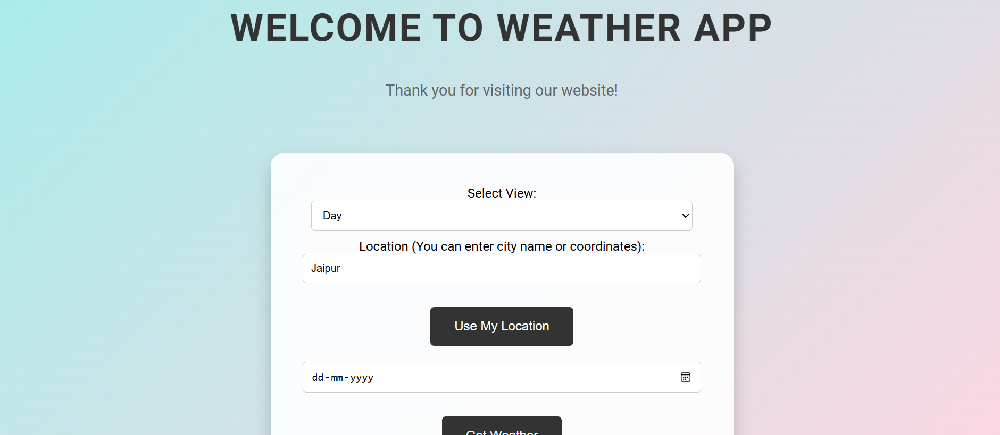

# Weather Forecast Website

## Overview

The Weather Forecast Website is a Django-based application that provides weather forecasts based on user-provided geolocation. Users can get current weather conditions and forecasts for any location. The app uses the VisualCrossing API to fetch weather data and includes rate limiting to ensure fair usage.

## Features

- **Current Weather**: View current weather conditions for any location.
- **Forecast**: Get weather forecasts for the coming days.
- **Geolocation**: Automatically detect and display weather for the user's location.
- **User Accounts**: Secure login and account management.
- **Rate Limiting**: Prevent abuse of the weather API with built-in rate limiting.

## Technologies

- **Backend**: Django
- **Frontend**: HTML, CSS, JavaScript
- **API**: VisualCrossing Weather API
- **Database**: SQLite

## Usage
This website is hosted at https://weather.someonewhoexists.hackclub.app/

1. **Accessing Weather Information**
   - Visit the home page to enter a location and get current weather information.
   - Use the forecast feature to view weather predictions for the upcoming days.

## Rate Limiting

The application includes rate limiting to prevent excessive requests to the weather API. This is configured in `middleware.py` and ensures fair usage across all users.

## Deployment

To deploy the application, follow these general steps:

1. **Prepare the Application for Production**
   - Update `settings.py` for production use, including setting `DEBUG` to `False` and configuring allowed hosts.

2. **Choose a Hosting Platform**
   - Deploy the application on platforms like Heroku, AWS, or DigitalOcean.

3. **Set Up Environment Variables**
   - Ensure environment variables are configured on the hosting platform.

4. **Run Migrations and Collect Static Files**
   ```bash
   python manage.py migrate
   python manage.py collectstatic
  
5. **Start the Application**
   Follow the deployment platform's instructions to start the application.

## Contributing
Contributions are welcome! If you'd like to set up the project locally, follow these steps:

1. Clone the Repository
```bash
  git clone https://github.com/someonewhoexists1210/WeatherAPI.git
  cd WeatherAPI
```
2. Create a Virtual Environment

```bash

  python -m venv venv
  Activate the Virtual Environment
```

### On Windows
```bash
venv\Scripts\activate
```

### On macOS/Linux:
```bash
source venv/bin/activate
```

3. Install Dependencies

```bash
pip install -r requirements.txt
```

4. Configure Environment Variables

Create a .env file in the root directory and add your environment variables:
```.env
SECRET_KEY=your_django_secret_key
WEATHER_API_KEY=your_visualcrossing_api_key
```
5. Run Migrations

```bash
python manage.py migrate
```


6. Run the Development Server
```bash   
python manage.py runserver
```

Access the website at http://127.0.0.1:8000/.
Please ensure that your code adheres to the project's coding standards and includes appropriate tests before submitting a pull request.

## Screenshot


## Contact
For any questions or issues, please contact [darshdiv20@gmail.com] (mailto:darshdiv20@gmail.com)
